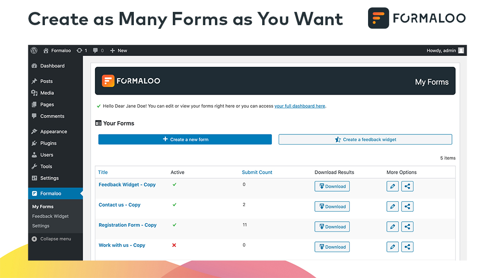
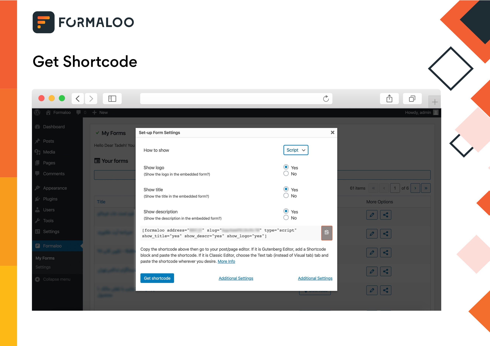
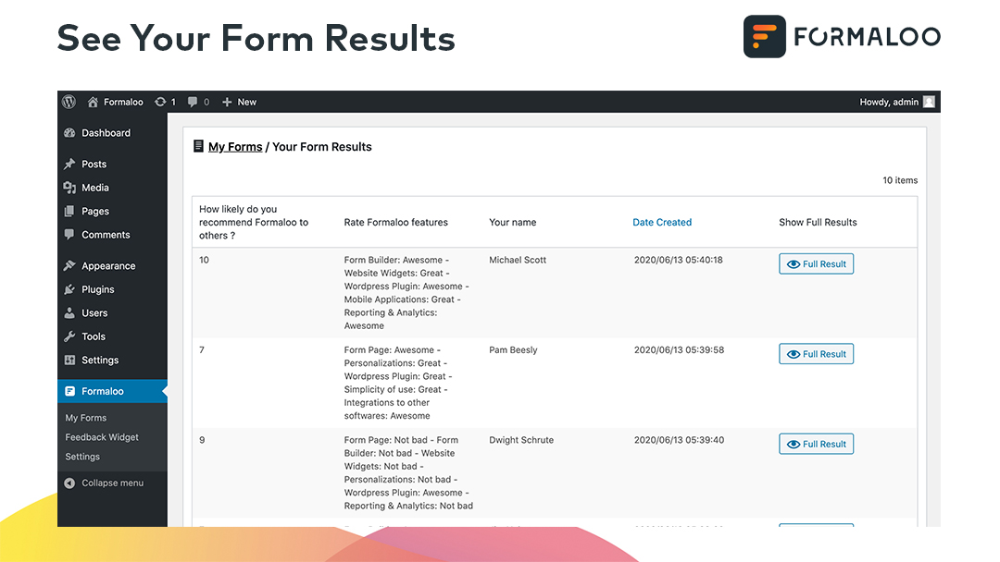

# Form Builder by Formaloo - Drag & Drop Form Builder for WordPress

| Requirement        | Version          
| ------------- |:-------------:|
| Requires at least | 4.0 |
| Tested up to | 5.4 |
| Stable tag | 1.5.0.0 |
| Requires PHP | 5.2 |

**Contributors:** Formaloo, idearun

**Tags:** contact form, contact form plugin, forms, form builder, custom form, contact button, contact me, custom contact form, form manager, form, forms builder, forms creator, captcha, recaptcha, email form, web form, feedback form, payment form, survey form, donation form, email submit form, message form, mailchimp, mailchimp form, paypal, paypal form, stripe, stripe form, email subscription, contact form widget, user registration form, wordpress registration, wordpress login form, feedback

**License:** GNU General Public License v2.0 or later

## Description

### WordPress Form Builder Plugin

"Smart forms made simple: The smart & visual way to understand your customers"

First, you don’t need to code. Second, you have the free cloud storage you need! And third, it’s completely FREE!. It’s fully responsive and can be used on any website, web service and mobile apps as well.

Our fully automatic, all‑in‑one Data Collection & Analysis Platform has the tools you need to grow—no coding or design skills required. Drive loyalty and growth at every stage of your customer lifecycle with Formaloo. Formaloo is the Forms & CRM for the next generations: No hassle, no fuss. Free, super Smart & ridiculously simple.

### Unlimited Forms, Unlimited Submits & Responses, Unlimited potential Customers

Don’t worry about anything! You won’t exceed anything in Formaloo. Just set it up & enjoy it.

### Pre-built Form Templates

Building any forms in WordPress can be hard, but with Formaloo, you can create any from from 100+ templates with just one click!

### Mobile Ready, SEO Friendly and Optimized for Speed

Formaloo forms are 100% responsive and mobile-friendly no matter what. We also optimized every form on the front-end and the back-end to ensure maximum speed & performance.

### Free Unlimited Cloud Storage

Need to add an uploaded file to your forms? Need to collect photos, documents, etc. from your community? Formaloo is made for you. You’ll have your own secure personal cloud storage in Formaloo.

And of course, you can download and export your files anytime you wish.

### Analyze Your Data: Your own BI dashboard

With our Data aggregation and analytics tools, you can empower and visualize your data and community.

### Accept Online Payments (Full Integration with PayPal, Stripe, etc.)

Start accepting online payments with Formaloo and get instant reports.

You can use Formaloo to create a payment form, donation form, registration form, online booking form, and more.

### GDPR & HIPAA Compliance

Your forms will be autmatically GDPR & HIPAA compatible. Don't worry about anything, We've got you back!

## Installation

1. Install Formaloo Form Builder either via the WordPress.org plugin repository or by uploading the files to your server. 
2. Activate Formaloo Form Builder.
3. Navigate to the Formaloo tab at the bottom of your admin menu and click the "Settings" button to begin.

## Screenshots

1. Formaloo Drag & Drop Online Form Builder

2. Add your forms in posts, pages and even in HTML templates

3. See your results instantly in your own website

4. Use your forms anywhere with Wordpress's Shortcode, in Gutenberg or classic wordpress editor

## Frequently Asked Questions

1. Do I need to have coding skills to use Formaloo? 

Absolutely not! 

2. What type of forms can I build with Formaloo?

Formaloo is not just a simple form builder, you can build any form that you can imagine with it, no matter how complex, Formaloo make it easy!

You can create any forms you like such as:

* ANY Contact Forms (simple & professional)
* Multi-step Surveys (100+ templates)
* Job Application Forms
* Registration Forms
* Newsletter Registration Forms
* Register to Download Forms
* Feedback Forms
* Online Booking Forms
* Event Booking Forms
* Call for paper Forms
* Scholarship Application Forms
* File Download Forms
* Employment Verification Forms
* Make a Referral Forms
* Volunteer Registration Forms
* CRM Connected Forms

To see a full list, visit our <a href="https://formaloo.net" rel="friend">website</a>.

3. Which Form Fields Does Formaloo support?

Formaloo is super flexibe and it's designed to be both simple and powerful.

Formlaoo supports all of these fields:

* Text Field
* Paragraph Text (Textarea)
* Dropdown Field
* Multiple Choice (Radio Buttons)
* Checkboxes
* Numbers Field
* Name Field
* Email Address Field
* Website / URL Field
* Address Field
* Date / Time Field
* File Upload - Great for File Upload Form
* Page Break Field - Great for Multi Page Contact Form with Progress Bar.
* Section Divider - Great for Long Contact Forms
* Star Rating - Great for Survey Forms and Polls
* Net Promoter Score (NPS Field) - Great for Professional Feedbacks
* Payment fields

4. Can I create a Payment Form with Formaloo?

Yes, Formaloo is the most flexible form builder that offers payment options. You can use Stripe or Paypal options or even better, you can have your own customized payment gateway connected straight to your forms!

5. Can I export my forms & submits?

Yes, you can export each of your form anytime you want with one click! It gives you all of your data at one place.

New: You can now sync your data with your Google Drive! You can connect your forms to your own Google Drive and edit it in your Google Sheet. This option is very popular for sharing the results with your team.

6. Can I integrate Formaloo with my CRM, e-commerce software, Email Marketing Service or Analytics tools?

Yes, Formaloo supoort 50+ most popular tools such as Mailchimp, Google tag manager & Analytics, Microsoft Dynamics, WooCommerce, etc. and with Formaloo API & samples, you can add your own integrations very easily.

See our <a href="https://api.formaloo.net/docs">API documentation</a> for more information.

## Changelog

### 1.1.0.4
- **Added:** Export & Sync your forms with your own Google Drive (Google Sheet)
- **Added:** Multi-langugage support added
- **Added:** RTL langugages support added
- **Fixed:** Loadtime increased by 300% 
- **Fixed:** Gutenberg compatibility improved

