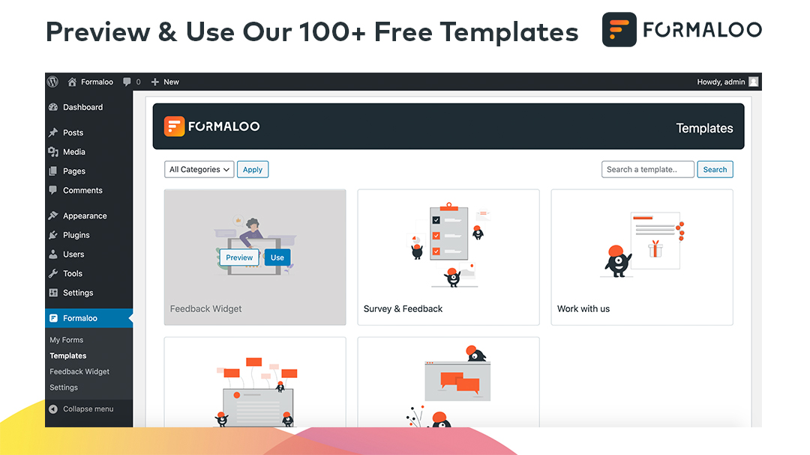
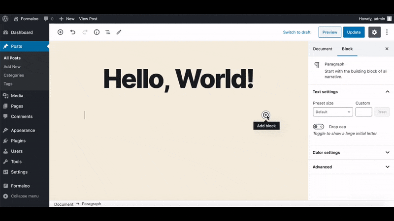

# Formaloo Form Maker & Customer Analytics for WordPress & WooCommerce

| Requirement        | Version          
| ------------- |:-------------:|
| Requires at least | 4.6 |
| Tested up to | 5.7.2 |
| Stable tag | 2.1.3.0 |
| Requires PHP | 5.6 |

**License:** GNU General Public License v2.0 or later

## Description

Create unlimited quizzes, surveys, and forms, collect unlimited responses completely free! Super easy, Enterprise-grade Analytics, and access your data anywhere, on any device—no programming skills required.

Create, edit, and send quizzes, forms, and surveys, review your results, build with 100+ expert templates, and more — seamlessly across your desktop, tablet, and phone.

Best of all you can analyze your whole audience with Formaloo Analytics right in the app! Engage & analyze your customers, students, and attendees and grow your business.

**Help You Meet GDPR & HIPAA Compliance Requirements**

Formaloo will help you to have technical requirements necessary for becoming GDPR ready & HIPAA compliance (There are a lot more steps to become 100% GDPR ready in your organization, but Formaloo will help you meet technical requirements that is needed for both GDPR & HIPPA guidelines) [Read More](https://en.formaloo.com/gdpr/).

**About Formaloo**

Today, over 17,000 companies & organizations in more than 30 countries use Formaloo's powerful and easy-to-use tools to transform the way they attract, engage, and delight their customers, students, and audience.

## Screenshots

1. Formaloo Drag & Drop Online Form Builder

2. Add your forms in posts, pages, and even in HTML templates

3. See your results instantly in your own website

4. Sync your WooCommerce customers and orders list hourly with your Formaloo CDP account

5. Provide the exact right amount of cashback for your loyal customers

6. Preview and use our 100+ free templates

7. Create and edit feedback widgets and put it on your website

8. Download your form results as an Excel Sheet quickly from the forms page

9. Select an existing form of yours or just paste any Formaloo form URL to embed it on your website

## Changelog

## 2.1.3.0
- RFM-based Tag Calculation added for customers! Tags can be seen via the Customers tab on your CDP dashboard
- Feedback Widget v2 is here: You can now create brand new widget types with different fields for your website!
- Improved WooCommerce Integration
- Minor bug fixes and improvements

## 2.0.0.1
- **NEW:** Full WooCommerce Integration added!
- Key bug fixes and major improvements

### 1.7.1.7
- Fix Language Issues
- Minor bug fixes and improvements

### 1.7.1.1
- **Added:** Adding Form Shortcode option is now added to the users who use the beloved Classic Editor!
- **Added:** You can now preview and use different form templates from Templates page
- **Updated:** You can now download your last requested excel file asynchronously
- **Added:** German and French Language Support
- Minor bug fixes and improvements

### 1.5.1.2
- **Added:** Create & Edit Feedback Widgets for your Website
- **Added:** Select an existing form of your Formaloo account in the Gutenberg block in addition to pasting any Formaloo form URL
- **Added:** Spanish Language Support
- Minor bug fixes and improvements

### 1.1.0.4
- **Added:** Export & Sync your forms with your own Google Drive (Google Sheet)
- **Added:** Multi-langugage support added
- **Added:** RTL langugages support added
- **Fixed:** Loadtime increased by 300% 
- **Fixed:** Gutenberg compatibility improved